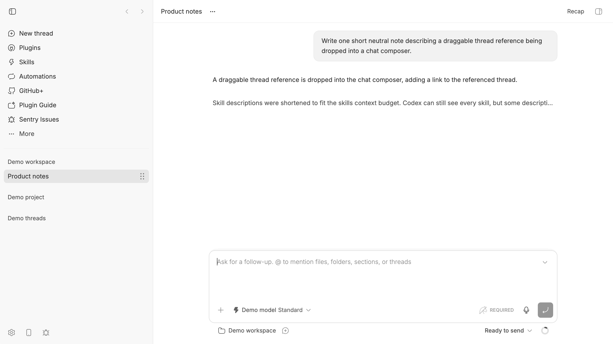

# Thread Reference

Thread Reference adds a small drag handle to each BB sidebar thread. Drag
the handle directly into a chat input to add a thread reference.



The demo shows the complete flow: drag a thread into the composer, send the
message with the native reference mention, and receive a response grounded in
that referenced thread.

The reference is a native BB composer mention. When the message is sent, the
plugin resolves the source thread and provides its title, id, and a bounded
conversation outline as agent-visible context. The composer only shows the
thread label, so the destination chat stays readable and the context remains
fresh. In sent messages, the reference mention is keyboard-accessible and
clickable, taking you back to the source thread.

## Install and develop

From this directory:

```sh
npm install
bb plugin install .
bb plugin dev
```

`bb plugin dev` rebuilds and reloads the plugin as files change. For a single
build, run `bb plugin build`; for an installed plugin, run:

```sh
bb plugin reload thread-reference
```

## How it works

- `app.tsx` registers a trusted content script that adds a dedicated drag
  handle to sidebar rows with `data-sidebar-thread-id`, handles drops on
  composer editors, and turns persisted thread mentions into links back to
  their source threads. BB's native row drag is temporarily disabled while
  the plugin is active so the handle is the only source for this reference
  drag; normal row clicking remains unchanged.
- The same frontend registers an invisible per-composer bridge. A drop on the
  actual input inserts a `thread-reference` mention and focuses the composer;
  no drop banner is rendered.
- `server.ts` registers the **Threads** mention provider. Search uses BB's
  thread index; resolution reads the source thread at send time and returns a
  bounded, prompt-injection-aware context block.
- `skills/thread-reference/SKILL.md` documents the workflow for agents.

References are read-only and do not alter the source thread.

## Manifest and SDK

`package.json` is the BB plugin manifest. The plugin pins the SDK version used
by the running BB. If the host is upgraded, refresh the declarations with:

```sh
bb plugin types
bb plugin types --check
```

The authoritative frontend and backend declarations are in
`node_modules/@get-bb/plugin-sdk/bundled-types/` after installation.
